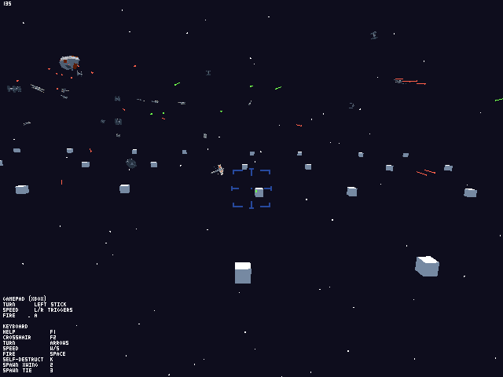
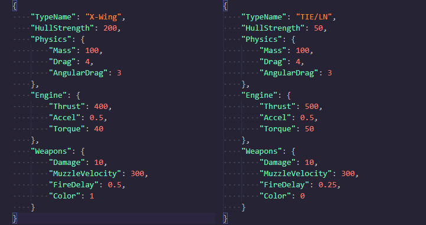
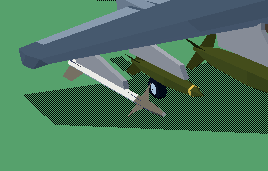
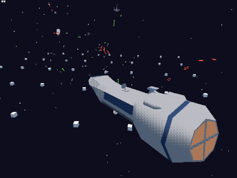
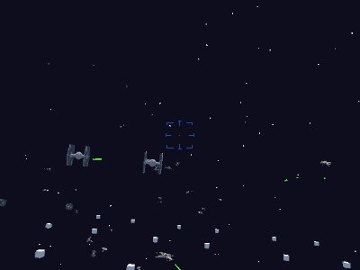
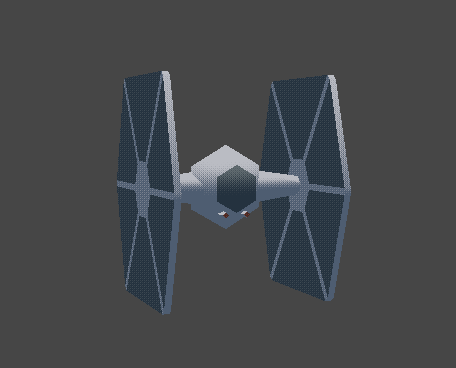
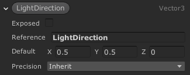
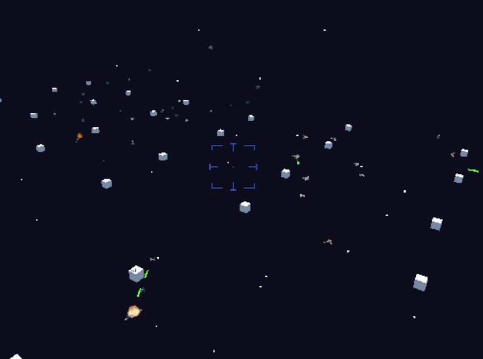

# Tiny X-Wing Tech Demo



This is the source code for the [quick X-Wing style game](https://why485.itch.io/tiny-x-wing) I made one weekend to test a few specific things. This is **NOT** meant to be an example of how to do anything well. It was a quick prototype thrown together to test a handful of very specific things, and I thought it'd be interesting to upload the source as it has examples of a few things I've never uploade before such as basic AI.

The code is messier than it needs to be because at the last second I thought it'd be cool to add capital ships and nothing about the game was designed to support capital ships so I had to make a lot of really hacky changes to support the Lancer frigates.

**I have no plans to maintain or update any of this code. It was written for academic purposes.**

This project was built in **Unity 2019.4.0f1**. 

# The JSON Loading Stuff



The primary goal of this project was to test loading gameplay related data from the disk rather than having it be stored inside Unity prefabs or Scriptable Objects.

The `ShipLibrary` class (found in [ShipLoader.cs](Assets/Scripts/Ship/ShipSpawner.cs)) loads all the ship parameters from JSON files stored in StreamingAssets. Whenever a ship is spawned using the `ShipSpawner` class, the ship is given the appropriate data to load in for properties such as speed and weapons, from the parsed data that `ShipLibrary` collected.

The main benefit of this approach is that it allows the end user to modify the data without needing the source project to edit prefabs or Scriptable Objects themselves. From a developer perspective, this is not necessarily great since it's harder to verify and edit data using things like Editor scripts.

## Lessons Learned, and Applied, for [Tiny Combat](https://why485.itch.io/tiny-combat-arena)



In my own experience [implementing this approach in Tiny Combat Arena](https://twitter.com/Why485/status/1286524235494633472), I've been finding that structing your code this way has a bunch of interesting side effects. My biggest concern initially was that everything is now [Stringly Typed](http://wiki.c2.com/?StringlyTyped), but the reality is that once the data is in the system, all the strings are going to be correct because it's all coming from the same place. 

This also allows a degree of separation between the logic and way the data is stored in a way that's not typical of how Unity works. In the most typical Unity use case, this kind of data is usually baked into a prefab. In the Tiny Combat example, there would be a Mk82 (bomb) prefab with its correct stats, then a Mk84 prefab (bigger bomb) with its own stats, and so on.

With this more JSON data-driven approach though, this changed. Instead, I've been using a single "archetype" prefab which contains all the necessary components to function as a bomb in gameplay, but needs to initialized with data coming from a JSON. The order of spawning a bomb (simplifying a bit for understanding) then becomes:

1. Data for all loadable stores brought in from disk
2. A bomb is needed, so the game spawned a `_Bomb` prefab
3. The newly spawned `_Bomb` is told to use the data for a `Mk82`
4. The bomb asks the `StoresLoader` (equivalent to this project's `ShipLoader`) for the data of a `Mk82` bomb
5. With that requested data, it spawned an appropriate model, and initializes its MonoBehaviours with data of a Mk82

An example of what a bomb's definition might look like in JSON:

```json
{
  "Store": {
    "DisplayName": "Mk82",
    "Description": "500lb unguided explosive bomb",
    "StoreType": "Bomb",
    "ModelPath": "Weapons/Bombs/Mk80Series/Mk82",
    "Mass": 227.0,
    "Length": 2.25,
    "Diameter": 0.275
  },
  "Warhead": {
    "Fuze": "Impact",
    "BlastRadius": 50.0,
    "Damage": 100.0
  }
}
```

# Spaceship AI



I've never actually uploaded any AI code for my projects. The thing with AI is that it tends to be so tailor made for every use case that it's hard to generalize in a way that I think might be useful. The best I think I can do is explain the general concepts I adhere to when writing AI, and give a code example of what it might look like.

Note: I don't think the AI code in this project is particularly good or easy to follow, especially because I hacked on so much to it in order to make the capital ships work.

All AI related code can be found in [Pilot.cs](Assets/Scripts/Ship/Pilot.cs).

### Turn Towards

The single most important function needed for AI to work is the ability for them to fly towards something. I almost always have a `TurnTowards` function which takes in a target position then applies input (pitch, yaw, roll) such that an AI pilot will point their ship at what they need to. This point could be anything from another spaceship to a predicted aiming point. It gets used for literally everything.

### Spread out Calculations!

AI calculations tend to be very expensive. *Especially* targeting code, since AI often have a lot of considerations to make when deciding what to target, or what they even can target. A trick I often use is to separate out "think" and "act" logic, then make it so that the expensive "think" functions are called in offset intervals rather than all AI running the same calculations on the same frame.

### Act vs Think
"Act" logic is the kind of logic that must run every frame. This is the moment to moment stuff such as manipulating the virtual joystick and throttle to fly a spaceship or plane. This should be as simple and straightforward as possible because it needs to happen all the time.

"Think" logic is decision making logic. Am I done doing what I was doing? What should I do next? What should I target now? This is the kind of logic that can be very expensive and should be done relatively infrequently (every 1-5 seconds vs every frame).

To space out the "think" logic, I typically use a simple timer so that it happens once a second or so. This prevents it from being run every frame, and also lets you design around the idea that an AI considers things only in certain time intervals. On top of that, I also offset this by a random number so that all AI don't "think" all at the same time. If they all do some expensive calculation all at once, the player will notice that frame took significantly longer than most frames.



### Modulating the Control Authority

This is a very space/flight sim trick, but making an AI perfectly turn towards a target is easy. That's not very fun though, as it means all fights turn into endless loops. To make fighting more fun and easy, a trick I use basically every time is to randomly change how hard the AI is allowed to turn. Sometimes they can turn with only 40% strength. Other times, 70%! It's all random, and it gives the player (and other AI) openings to fire on, or escape from targets. Adding randomness, particularly to timing, can also make the AI seem more unpredictable and smarter than they really are.

### It's all Fake

 I've gotten a lot of feedback on my games from people praising the AI, but really they're dumb as bricks and often do total nonsense that gets them killed. Remember, all AI is just an illusion. Very simple (even random!) behaviors can result in emergent behavior that players mistake for intelligence.

# Custom Shaders



This project uses the Universal Render Pipeline, along with ShaderGraph to create the shaders. They are similar in principle to [how the shaders in Tiny Combat](Screenshots/T62.png) work.

Ever since learning more about custom shaders, I've admittedly become a bit of a snob when it comes to low poly retro style graphics. Fancy modern physically based shading is very different from the dead simple Lambertian style shading commonly used in older games, so I think if you're trying to go for a nostalgic style you should really consider creating custom shaders to match the look.

## Global Variables in Shader Graph

Since I want to calculate my own lighting, and Shader Graph doesn't support custom lighting models the way the Built-Renderer used to, I need to pass in my own light direction to be used for lighting calculations. This means I can only have one light source (the sun) but for my purposes that's fine. I don't remember where I read how to do this, because it's not obvious at all, but it's essential and powerful.

On the game's light, you'll see a script called `ShaderLighting`. All this does is pass the direction of the light into a shader-accessible global variable called `LightDirection`.

```cs
Shader.SetGlobalVector("LightDirection", -LightSource.transform.forward);
```

To use the data in this variable from Shader Graph, you need to add a property that **matches the name exactly**, and **uncheck Exposed**. My understanding is that this is used for internal variables to the shader, and when it matches a global shader variable, it will take on its value.



From there you can use the property in the graph like any other. Note though that in the preview window, it'll use only whatever the default value is. You won't see the shader running with the "true" values until it's running in the scene and these global variables are being set.

Another interesting thing to note is that once you set a global variable, it retains that value for as long as the Editor is open, even between play sessions.

# Cut Code/Content

In order to open source this, I had to strip some content/features for licensing reasons. When possible, the code is left in, so that if you have these assets you could drop them in and uncomment the code.

## Odin Inspector

[Odin Inspector](https://odininspector.com/) was used to make certain things more convenient for testing. This wasn't central to the working of this project, but it made testing the JSON loading/unloading easier. All the Odin related code is still in the project and can be found by searching for the `Sirenix` namespace.

This asset has only gotten better with time. Even if you don't get too into the power user custom inspector stuff, it makes a lot of the Unity Editor UI better in a way that Unity should look into making native. I recommend it.

## Shapes



I've long been annoyed at the difficulty that Unity has with drawing clean and pixel perfect lines. [Freya Holmer](https://twitter.com/FreyaHolmer) has developed the [plugin of my dreams, Shapes](https://acegikmo.com/shapes/). It was just released and having used it only in demo environments I was curious to trial it in a simple standalone and practical project before taking the plunge and attempting to integrate it into Tiny Combat.

In this project, I used it for debug visuals, the stars in the skybox, and as an aid in drawing the lasers so that lasers always appeared as continuous pixel lines even when far from the camera. It's a joy to work with and I highly recommend it!

As with Odin, the code remains in place and can be found by searching for the `Shapes` namespace. It's just been commented out. The stars have been replaced with quads. The laser line drawing has been replaced with [code which scales the lasers](Assets/Scripts/Weapons/LaserScaling.cs) based on distance to mimic the effect. It's not pixel perfect the way Shapes is, but it's a good enough approximation for this project.

## All the Audio

All sound effects have been removed due to licensing. All the `AudioSource` components, as well as a few audio related scripts, are still intact, so a sufficiently motivated individual should be able to add back in all the sound effects.
